# Autonomous timed pilot

Pilot validation evidence; training-exposed selection. No baseline, continuity, novelty, frozen-test, or final Phase 4 gate claim.

Conclusion: production learning gate not established by this report. A completed execution is distinct from a passed scientific gate.

Training status: robustness_complete; updates: 12000; seed: 11.
Weights: eligible selected

## attempt-ee4586a18d90439590c88bf5c12904ff/validation-1000-one_hop/autonomous

Experiment: phase4-pilot-v1; purpose: pilot_validation; split: validation; stage: one_hop.
Source: `3b132253512f02c0ed9f2d774fefce3036019d91`; config: `62b892f07b07b8b943121a7084d2492e33bb4e295e5dc311f50f9bed23b57729`; manifest: `292a1bf67bbba850db52ff644c6992d520620c08d04191aaa36dcbba8e1e5aa6`; checkpoint: `c7ec47ff19ff173dd46ead2ac0eaa4a4eb611b62703e0c9a70aade0643d60d74`; model seed: 11.

| Outcome | Count / denominator |
| --- | ---: |
| Timed success | 5904 / 10000 |
| Negative false action | 148 / 5000 |
| Errors | 0 / 10000 |

| Variant | Episodes | Timed success |
| --- | ---: | ---: |
| disconnected_negative | 2500 | 2352 |
| positive | 5000 | 1052 |
| safe_negative | 2500 | 2500 |

| Class | Episodes | Timed success |
| --- | ---: | ---: |
| 0 | 1245 | 359 |
| 1 | 1220 | 263 |
| 2 | 1284 | 293 |
| 3 | 1251 | 137 |
| negative | 5000 | 4852 |

| Event counts | Count |
| --- | ---: |
| act | 5131 |
| activate | 10000 |
| compose | 17762 |
| fact | 59983 |
| recall | 17762 |
| terminal | 10000 |

| Miss categories | Count |
| --- | ---: |
| late | 20 |
| negative_false_action | 148 |
| no_action | 17 |
| premature | 3911 |
| success | 5904 |

| Compute | Count |
| --- | ---: |
| backward_macs | 0 |
| flow_evaluations | 120638 |
| forward_macs | 1038126604032 |
| foundation_model_calls | 0 |
| jump_applications | 120638 |
| records_scored | 4378688 |

| Action diagnostics | Count |
| --- | ---: |
| legal_class_0 | 1260 |
| legal_class_1 | 1254 |
| legal_class_2 | 1323 |
| legal_class_3 | 1294 |
| raw_class_0 | 1260 |
| raw_class_1 | 1254 |
| raw_class_2 | 1323 |
| raw_class_3 | 1294 |
| status_disagreements | 0 |

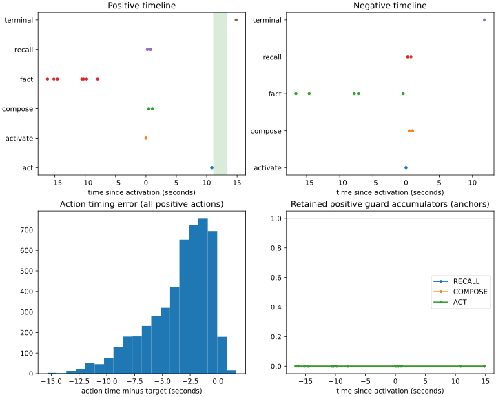

## attempt-ee4586a18d90439590c88bf5c12904ff/validation-10000-two_hop/autonomous

Experiment: phase4-pilot-v1; purpose: pilot_validation; split: validation; stage: two_hop.
Source: `3b132253512f02c0ed9f2d774fefce3036019d91`; config: `62b892f07b07b8b943121a7084d2492e33bb4e295e5dc311f50f9bed23b57729`; manifest: `1cfb1f613578eafc0e6ef7c2c664006e4ee7331e9ae324ba65f3376783a50c45`; checkpoint: `cf806132f9e050ad595f3b92a302834c93eac9df206baa6b1a02d9eb162c7163`; model seed: 11.

| Outcome | Count / denominator |
| --- | ---: |
| Timed success | 9998 / 10000 |
| Negative false action | 0 / 5000 |
| Errors | 0 / 10000 |

| Variant | Episodes | Timed success |
| --- | ---: | ---: |
| disconnected_negative | 2500 | 2500 |
| positive | 5000 | 4998 |
| safe_negative | 2500 | 2500 |

| Class | Episodes | Timed success |
| --- | ---: | ---: |
| 0 | 1211 | 1211 |
| 1 | 1239 | 1238 |
| 2 | 1221 | 1220 |
| 3 | 1329 | 1329 |
| negative | 5000 | 5000 |

| Event counts | Count |
| --- | ---: |
| act | 5000 |
| activate | 10000 |
| compose | 27500 |
| fact | 110683 |
| recall | 27500 |
| terminal | 10000 |

| Miss categories | Count |
| --- | ---: |
| late | 2 |
| success | 9998 |

| Compute | Count |
| --- | ---: |
| backward_macs | 0 |
| flow_evaluations | 190683 |
| forward_macs | 1570397850880 |
| foundation_model_calls | 0 |
| jump_applications | 190683 |
| records_scored | 6240000 |

| Action diagnostics | Count |
| --- | ---: |
| legal_class_0 | 1211 |
| legal_class_1 | 1239 |
| legal_class_2 | 1221 |
| legal_class_3 | 1329 |
| raw_class_0 | 1211 |
| raw_class_1 | 1239 |
| raw_class_2 | 1221 |
| raw_class_3 | 1329 |
| status_disagreements | 0 |

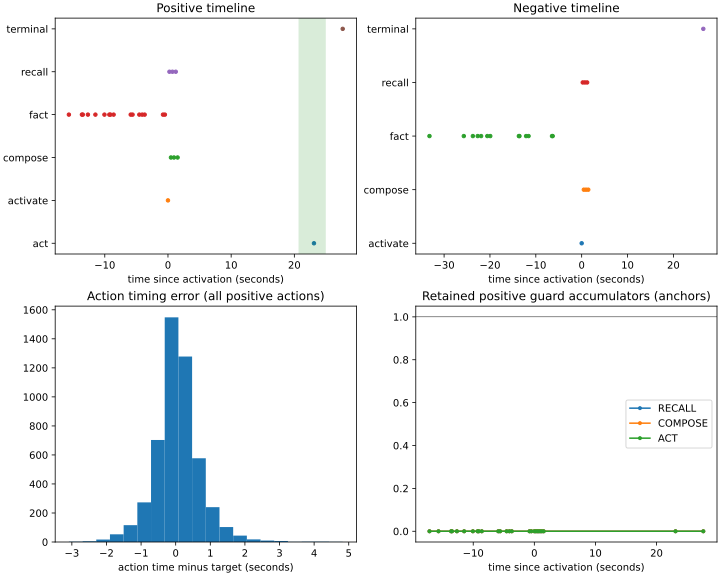

## attempt-ee4586a18d90439590c88bf5c12904ff/validation-11000-primary/autonomous

Experiment: phase4-pilot-v1; purpose: pilot_validation; split: validation; stage: primary.
Source: `3b132253512f02c0ed9f2d774fefce3036019d91`; config: `62b892f07b07b8b943121a7084d2492e33bb4e295e5dc311f50f9bed23b57729`; manifest: `b0e884d4e62acb4e2f9ad39d0b9fa77e9e064264ef1d9b4da0503302a31ce89f`; checkpoint: `c0181cd9a790df9c558ac4c11b4faf7b8735aad61b1f0225466923b171091a3c`; model seed: 11.

| Outcome | Count / denominator |
| --- | ---: |
| Timed success | 9996 / 10000 |
| Negative false action | 0 / 5000 |
| Errors | 0 / 10000 |

| Variant | Episodes | Timed success |
| --- | ---: | ---: |
| disconnected_negative | 2500 | 2500 |
| positive | 5000 | 4996 |
| safe_negative | 2500 | 2500 |

| Class | Episodes | Timed success |
| --- | ---: | ---: |
| 0 | 1226 | 1225 |
| 1 | 1239 | 1239 |
| 2 | 1266 | 1266 |
| 3 | 1269 | 1266 |
| negative | 5000 | 5000 |

| Event counts | Count |
| --- | ---: |
| act | 5000 |
| activate | 10000 |
| compose | 37460 |
| fact | 120065 |
| recall | 37460 |
| terminal | 10000 |

| Miss categories | Count |
| --- | ---: |
| late | 4 |
| success | 9996 |

| Compute | Count |
| --- | ---: |
| backward_macs | 0 |
| flow_evaluations | 219985 |
| forward_macs | 1959736784640 |
| foundation_model_calls | 0 |
| jump_applications | 219985 |
| records_scored | 8152320 |

| Action diagnostics | Count |
| --- | ---: |
| legal_class_0 | 1226 |
| legal_class_1 | 1239 |
| legal_class_2 | 1266 |
| legal_class_3 | 1269 |
| raw_class_0 | 1226 |
| raw_class_1 | 1239 |
| raw_class_2 | 1266 |
| raw_class_3 | 1269 |
| status_disagreements | 0 |

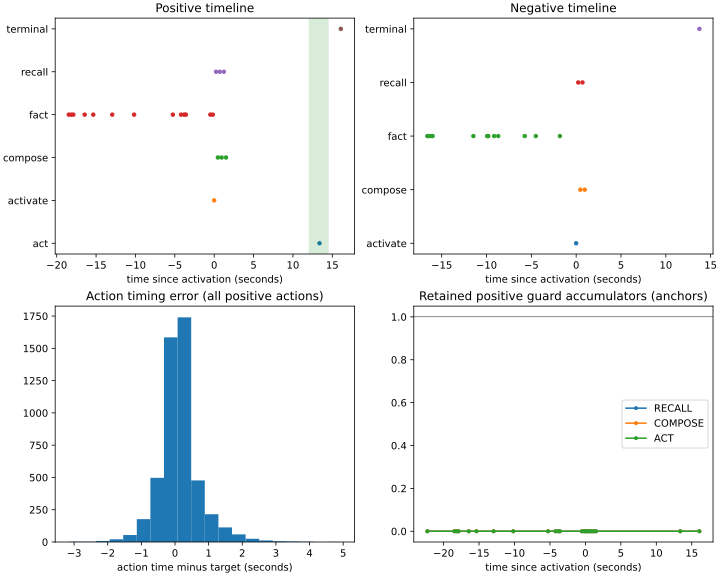

## attempt-ee4586a18d90439590c88bf5c12904ff/validation-12000-primary/autonomous

Experiment: phase4-pilot-v1; purpose: pilot_validation; split: validation; stage: primary.
Source: `3b132253512f02c0ed9f2d774fefce3036019d91`; config: `62b892f07b07b8b943121a7084d2492e33bb4e295e5dc311f50f9bed23b57729`; manifest: `b0e884d4e62acb4e2f9ad39d0b9fa77e9e064264ef1d9b4da0503302a31ce89f`; checkpoint: `bc2850deb2bacb64d336750c5e824390e4a8eb45a3144467e3a61af84c49285b`; model seed: 11.

| Outcome | Count / denominator |
| --- | ---: |
| Timed success | 9994 / 10000 |
| Negative false action | 1 / 5000 |
| Errors | 0 / 10000 |

| Variant | Episodes | Timed success |
| --- | ---: | ---: |
| disconnected_negative | 2500 | 2499 |
| positive | 5000 | 4995 |
| safe_negative | 2500 | 2500 |

| Class | Episodes | Timed success |
| --- | ---: | ---: |
| 0 | 1226 | 1226 |
| 1 | 1239 | 1237 |
| 2 | 1266 | 1265 |
| 3 | 1269 | 1267 |
| negative | 5000 | 4999 |

| Event counts | Count |
| --- | ---: |
| act | 5001 |
| activate | 10000 |
| compose | 37461 |
| fact | 120065 |
| recall | 37461 |
| terminal | 10000 |

| Miss categories | Count |
| --- | ---: |
| late | 3 |
| negative_false_action | 1 |
| premature | 2 |
| success | 9994 |

| Compute | Count |
| --- | ---: |
| backward_macs | 0 |
| flow_evaluations | 219988 |
| forward_macs | 1959786497536 |
| foundation_model_calls | 0 |
| jump_applications | 219988 |
| records_scored | 8152576 |

| Action diagnostics | Count |
| --- | ---: |
| legal_class_0 | 1226 |
| legal_class_1 | 1240 |
| legal_class_2 | 1266 |
| legal_class_3 | 1269 |
| raw_class_0 | 1226 |
| raw_class_1 | 1240 |
| raw_class_2 | 1266 |
| raw_class_3 | 1269 |
| status_disagreements | 0 |

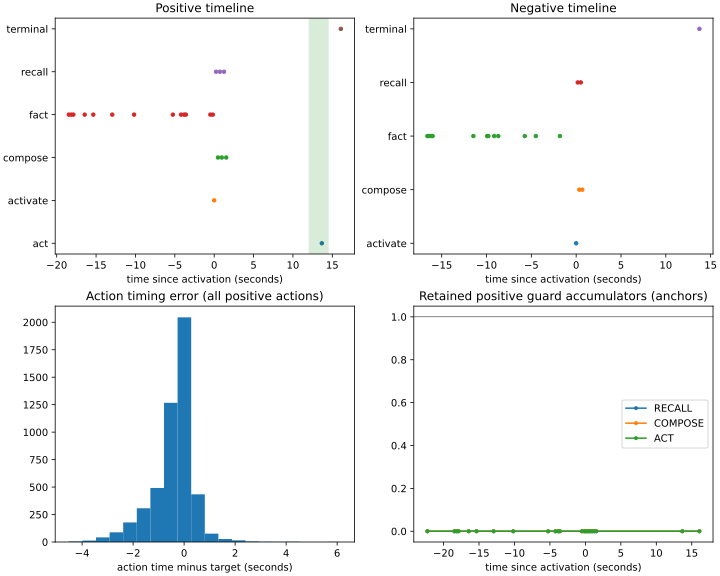

## attempt-ee4586a18d90439590c88bf5c12904ff/validation-12000-robustness/autonomous

Experiment: phase4-pilot-v1; purpose: pilot_validation; split: validation; stage: robustness.
Source: `3b132253512f02c0ed9f2d774fefce3036019d91`; config: `62b892f07b07b8b943121a7084d2492e33bb4e295e5dc311f50f9bed23b57729`; manifest: `6ca3e94add1e3f193e2a9bc96b477643e222e6569dce86851743f76f7e6b48d3`; checkpoint: `bc2850deb2bacb64d336750c5e824390e4a8eb45a3144467e3a61af84c49285b`; model seed: 11.

| Outcome | Count / denominator |
| --- | ---: |
| Timed success | 9966 / 10000 |
| Negative false action | 1 / 5000 |
| Errors | 0 / 10000 |

| Variant | Episodes | Timed success |
| --- | ---: | ---: |
| disconnected_negative | 2500 | 2499 |
| positive | 5000 | 4967 |
| safe_negative | 2500 | 2500 |

| Class | Episodes | Timed success |
| --- | ---: | ---: |
| 0 | 1246 | 1236 |
| 1 | 1219 | 1214 |
| 2 | 1223 | 1215 |
| 3 | 1312 | 1302 |
| negative | 5000 | 4999 |

| Event counts | Count |
| --- | ---: |
| act | 5001 |
| activate | 10000 |
| compose | 37546 |
| fact | 119778 |
| recall | 37546 |
| terminal | 10000 |

| Miss categories | Count |
| --- | ---: |
| late | 21 |
| negative_false_action | 1 |
| premature | 12 |
| success | 9966 |

| Compute | Count |
| --- | ---: |
| backward_macs | 0 |
| flow_evaluations | 219871 |
| forward_macs | 1961752723456 |
| foundation_model_calls | 0 |
| jump_applications | 219871 |
| records_scored | 8168896 |

| Action diagnostics | Count |
| --- | ---: |
| legal_class_0 | 1246 |
| legal_class_1 | 1219 |
| legal_class_2 | 1223 |
| legal_class_3 | 1313 |
| raw_class_0 | 1246 |
| raw_class_1 | 1219 |
| raw_class_2 | 1223 |
| raw_class_3 | 1313 |
| status_disagreements | 0 |

## attempt-ee4586a18d90439590c88bf5c12904ff/validation-2000-one_hop/autonomous

Experiment: phase4-pilot-v1; purpose: pilot_validation; split: validation; stage: one_hop.
Source: `3b132253512f02c0ed9f2d774fefce3036019d91`; config: `62b892f07b07b8b943121a7084d2492e33bb4e295e5dc311f50f9bed23b57729`; manifest: `292a1bf67bbba850db52ff644c6992d520620c08d04191aaa36dcbba8e1e5aa6`; checkpoint: `caa969aeb2077a5edea3a52d31fda9c545e8bc6a0a2d8e49d2dcf0d23c990289`; model seed: 11.

| Outcome | Count / denominator |
| --- | ---: |
| Timed success | 9578 / 10000 |
| Negative false action | 0 / 5000 |
| Errors | 0 / 10000 |

| Variant | Episodes | Timed success |
| --- | ---: | ---: |
| disconnected_negative | 2500 | 2500 |
| positive | 5000 | 4578 |
| safe_negative | 2500 | 2500 |

| Class | Episodes | Timed success |
| --- | ---: | ---: |
| 0 | 1245 | 1119 |
| 1 | 1220 | 1196 |
| 2 | 1284 | 1241 |
| 3 | 1251 | 1022 |
| negative | 5000 | 5000 |

| Event counts | Count |
| --- | ---: |
| act | 4996 |
| activate | 10000 |
| compose | 17497 |
| fact | 59983 |
| recall | 17497 |
| terminal | 10000 |

| Miss categories | Count |
| --- | ---: |
| late | 15 |
| no_action | 4 |
| premature | 403 |
| success | 9578 |

| Compute | Count |
| --- | ---: |
| backward_macs | 0 |
| flow_evaluations | 119973 |
| forward_macs | 1026786414592 |
| foundation_model_calls | 0 |
| jump_applications | 119973 |
| records_scored | 4319168 |

| Action diagnostics | Count |
| --- | ---: |
| legal_class_0 | 1245 |
| legal_class_1 | 1220 |
| legal_class_2 | 1283 |
| legal_class_3 | 1248 |
| raw_class_0 | 1245 |
| raw_class_1 | 1220 |
| raw_class_2 | 1283 |
| raw_class_3 | 1248 |
| status_disagreements | 0 |

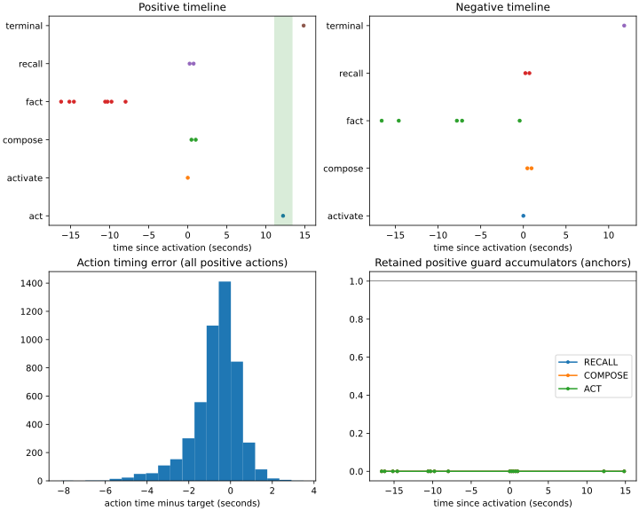

## attempt-ee4586a18d90439590c88bf5c12904ff/validation-3000-one_hop/autonomous

Experiment: phase4-pilot-v1; purpose: pilot_validation; split: validation; stage: one_hop.
Source: `3b132253512f02c0ed9f2d774fefce3036019d91`; config: `62b892f07b07b8b943121a7084d2492e33bb4e295e5dc311f50f9bed23b57729`; manifest: `292a1bf67bbba850db52ff644c6992d520620c08d04191aaa36dcbba8e1e5aa6`; checkpoint: `fe35c3bd69e3d686714e202c56e51ce572fc23fbd5e8b0c934e21bb1a05aee86`; model seed: 11.

| Outcome | Count / denominator |
| --- | ---: |
| Timed success | 9831 / 10000 |
| Negative false action | 3 / 5000 |
| Errors | 0 / 10000 |

| Variant | Episodes | Timed success |
| --- | ---: | ---: |
| disconnected_negative | 2500 | 2497 |
| positive | 5000 | 4834 |
| safe_negative | 2500 | 2500 |

| Class | Episodes | Timed success |
| --- | ---: | ---: |
| 0 | 1245 | 1206 |
| 1 | 1220 | 1181 |
| 2 | 1284 | 1251 |
| 3 | 1251 | 1196 |
| negative | 5000 | 4997 |

| Event counts | Count |
| --- | ---: |
| act | 5003 |
| activate | 10000 |
| compose | 17503 |
| fact | 59983 |
| recall | 17503 |
| terminal | 10000 |

| Miss categories | Count |
| --- | ---: |
| late | 98 |
| negative_false_action | 3 |
| premature | 68 |
| success | 9831 |

| Compute | Count |
| --- | ---: |
| backward_macs | 0 |
| flow_evaluations | 119992 |
| forward_macs | 1027098797568 |
| foundation_model_calls | 0 |
| jump_applications | 119992 |
| records_scored | 4320768 |

| Action diagnostics | Count |
| --- | ---: |
| legal_class_0 | 1245 |
| legal_class_1 | 1222 |
| legal_class_2 | 1284 |
| legal_class_3 | 1252 |
| raw_class_0 | 1245 |
| raw_class_1 | 1222 |
| raw_class_2 | 1284 |
| raw_class_3 | 1252 |
| status_disagreements | 0 |

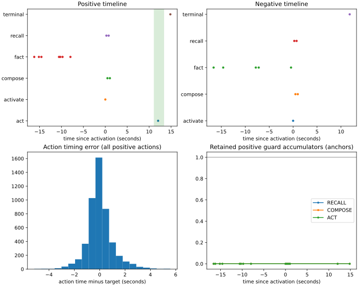

## attempt-ee4586a18d90439590c88bf5c12904ff/validation-4000-one_hop/autonomous

Experiment: phase4-pilot-v1; purpose: pilot_validation; split: validation; stage: one_hop.
Source: `3b132253512f02c0ed9f2d774fefce3036019d91`; config: `62b892f07b07b8b943121a7084d2492e33bb4e295e5dc311f50f9bed23b57729`; manifest: `292a1bf67bbba850db52ff644c6992d520620c08d04191aaa36dcbba8e1e5aa6`; checkpoint: `39a4a14edc34c577a142543e628bda8561d783761bef79292ec28c5798da3587`; model seed: 11.

| Outcome | Count / denominator |
| --- | ---: |
| Timed success | 9816 / 10000 |
| Negative false action | 0 / 5000 |
| Errors | 0 / 10000 |

| Variant | Episodes | Timed success |
| --- | ---: | ---: |
| disconnected_negative | 2500 | 2500 |
| positive | 5000 | 4816 |
| safe_negative | 2500 | 2500 |

| Class | Episodes | Timed success |
| --- | ---: | ---: |
| 0 | 1245 | 1179 |
| 1 | 1220 | 1201 |
| 2 | 1284 | 1273 |
| 3 | 1251 | 1163 |
| negative | 5000 | 5000 |

| Event counts | Count |
| --- | ---: |
| act | 4998 |
| activate | 10000 |
| compose | 17498 |
| fact | 59983 |
| recall | 17498 |
| terminal | 10000 |

| Miss categories | Count |
| --- | ---: |
| late | 182 |
| no_action | 2 |
| success | 9816 |

| Compute | Count |
| --- | ---: |
| backward_macs | 0 |
| flow_evaluations | 119977 |
| forward_macs | 1026850233088 |
| foundation_model_calls | 0 |
| jump_applications | 119977 |
| records_scored | 4319488 |

| Action diagnostics | Count |
| --- | ---: |
| legal_class_0 | 1245 |
| legal_class_1 | 1220 |
| legal_class_2 | 1282 |
| legal_class_3 | 1251 |
| raw_class_0 | 1245 |
| raw_class_1 | 1220 |
| raw_class_2 | 1282 |
| raw_class_3 | 1251 |
| status_disagreements | 0 |

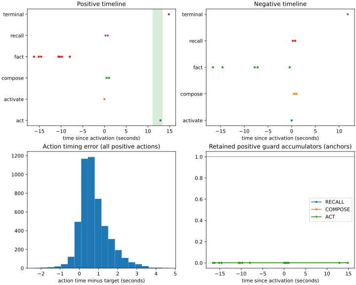

## attempt-ee4586a18d90439590c88bf5c12904ff/validation-5000-one_hop/autonomous

Experiment: phase4-pilot-v1; purpose: pilot_validation; split: validation; stage: one_hop.
Source: `3b132253512f02c0ed9f2d774fefce3036019d91`; config: `62b892f07b07b8b943121a7084d2492e33bb4e295e5dc311f50f9bed23b57729`; manifest: `292a1bf67bbba850db52ff644c6992d520620c08d04191aaa36dcbba8e1e5aa6`; checkpoint: `9af47e5cdee6657f1a2fecf25919cba8a3e6858656039d2865986bc0c4927e56`; model seed: 11.

| Outcome | Count / denominator |
| --- | ---: |
| Timed success | 9977 / 10000 |
| Negative false action | 1 / 5000 |
| Errors | 0 / 10000 |

| Variant | Episodes | Timed success |
| --- | ---: | ---: |
| disconnected_negative | 2500 | 2499 |
| positive | 5000 | 4978 |
| safe_negative | 2500 | 2500 |

| Class | Episodes | Timed success |
| --- | ---: | ---: |
| 0 | 1245 | 1239 |
| 1 | 1220 | 1208 |
| 2 | 1284 | 1282 |
| 3 | 1251 | 1249 |
| negative | 5000 | 4999 |

| Event counts | Count |
| --- | ---: |
| act | 4997 |
| activate | 10000 |
| compose | 17499 |
| fact | 59983 |
| recall | 17499 |
| terminal | 10000 |

| Miss categories | Count |
| --- | ---: |
| late | 17 |
| negative_false_action | 1 |
| no_action | 4 |
| premature | 1 |
| success | 9977 |

| Compute | Count |
| --- | ---: |
| backward_macs | 0 |
| flow_evaluations | 119978 |
| forward_macs | 1026871734784 |
| foundation_model_calls | 0 |
| jump_applications | 119978 |
| records_scored | 4319616 |

| Action diagnostics | Count |
| --- | ---: |
| legal_class_0 | 1245 |
| legal_class_1 | 1218 |
| legal_class_2 | 1283 |
| legal_class_3 | 1251 |
| raw_class_0 | 1245 |
| raw_class_1 | 1218 |
| raw_class_2 | 1283 |
| raw_class_3 | 1251 |
| status_disagreements | 0 |

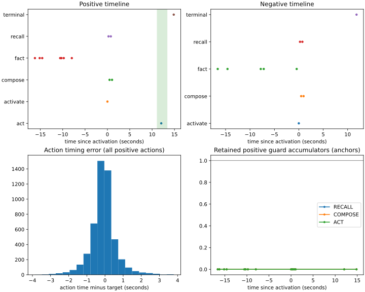

## attempt-ee4586a18d90439590c88bf5c12904ff/validation-6000-one_hop/autonomous

Experiment: phase4-pilot-v1; purpose: pilot_validation; split: validation; stage: one_hop.
Source: `3b132253512f02c0ed9f2d774fefce3036019d91`; config: `62b892f07b07b8b943121a7084d2492e33bb4e295e5dc311f50f9bed23b57729`; manifest: `292a1bf67bbba850db52ff644c6992d520620c08d04191aaa36dcbba8e1e5aa6`; checkpoint: `cb4b32ec608ad4ac867c76fdbefbf708f45db796c766459ff01d47caeb40cad3`; model seed: 11.

| Outcome | Count / denominator |
| --- | ---: |
| Timed success | 9985 / 10000 |
| Negative false action | 7 / 5000 |
| Errors | 0 / 10000 |

| Variant | Episodes | Timed success |
| --- | ---: | ---: |
| disconnected_negative | 2500 | 2493 |
| positive | 5000 | 4992 |
| safe_negative | 2500 | 2500 |

| Class | Episodes | Timed success |
| --- | ---: | ---: |
| 0 | 1245 | 1245 |
| 1 | 1220 | 1216 |
| 2 | 1284 | 1281 |
| 3 | 1251 | 1250 |
| negative | 5000 | 4993 |

| Event counts | Count |
| --- | ---: |
| act | 5007 |
| activate | 10000 |
| compose | 17510 |
| fact | 59983 |
| recall | 17510 |
| terminal | 10000 |

| Miss categories | Count |
| --- | ---: |
| late | 2 |
| negative_false_action | 7 |
| premature | 6 |
| success | 9985 |

| Compute | Count |
| --- | ---: |
| backward_macs | 0 |
| flow_evaluations | 120010 |
| forward_macs | 1027404471040 |
| foundation_model_calls | 0 |
| jump_applications | 120010 |
| records_scored | 4322368 |

| Action diagnostics | Count |
| --- | ---: |
| legal_class_0 | 1247 |
| legal_class_1 | 1221 |
| legal_class_2 | 1286 |
| legal_class_3 | 1253 |
| raw_class_0 | 1247 |
| raw_class_1 | 1221 |
| raw_class_2 | 1286 |
| raw_class_3 | 1253 |
| status_disagreements | 0 |

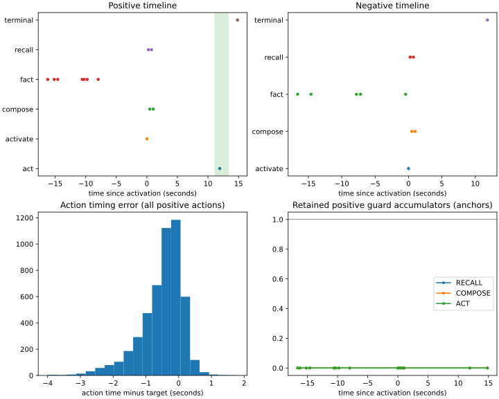

## attempt-ee4586a18d90439590c88bf5c12904ff/validation-7000-one_hop/autonomous

Experiment: phase4-pilot-v1; purpose: pilot_validation; split: validation; stage: one_hop.
Source: `3b132253512f02c0ed9f2d774fefce3036019d91`; config: `62b892f07b07b8b943121a7084d2492e33bb4e295e5dc311f50f9bed23b57729`; manifest: `292a1bf67bbba850db52ff644c6992d520620c08d04191aaa36dcbba8e1e5aa6`; checkpoint: `8e29f82b2e9f146b7797ebab3799a72cdd316fdc7f308b8dc48c6570dc21b93e`; model seed: 11.

| Outcome | Count / denominator |
| --- | ---: |
| Timed success | 9985 / 10000 |
| Negative false action | 0 / 5000 |
| Errors | 0 / 10000 |

| Variant | Episodes | Timed success |
| --- | ---: | ---: |
| disconnected_negative | 2500 | 2500 |
| positive | 5000 | 4985 |
| safe_negative | 2500 | 2500 |

| Class | Episodes | Timed success |
| --- | ---: | ---: |
| 0 | 1245 | 1238 |
| 1 | 1220 | 1219 |
| 2 | 1284 | 1277 |
| 3 | 1251 | 1251 |
| negative | 5000 | 5000 |

| Event counts | Count |
| --- | ---: |
| act | 5000 |
| activate | 10000 |
| compose | 17500 |
| fact | 59983 |
| recall | 17500 |
| terminal | 10000 |

| Miss categories | Count |
| --- | ---: |
| late | 1 |
| premature | 14 |
| success | 9985 |

| Compute | Count |
| --- | ---: |
| backward_macs | 0 |
| flow_evaluations | 119983 |
| forward_macs | 1026949658880 |
| foundation_model_calls | 0 |
| jump_applications | 119983 |
| records_scored | 4320000 |

| Action diagnostics | Count |
| --- | ---: |
| legal_class_0 | 1245 |
| legal_class_1 | 1220 |
| legal_class_2 | 1284 |
| legal_class_3 | 1251 |
| raw_class_0 | 1245 |
| raw_class_1 | 1220 |
| raw_class_2 | 1284 |
| raw_class_3 | 1251 |
| status_disagreements | 0 |

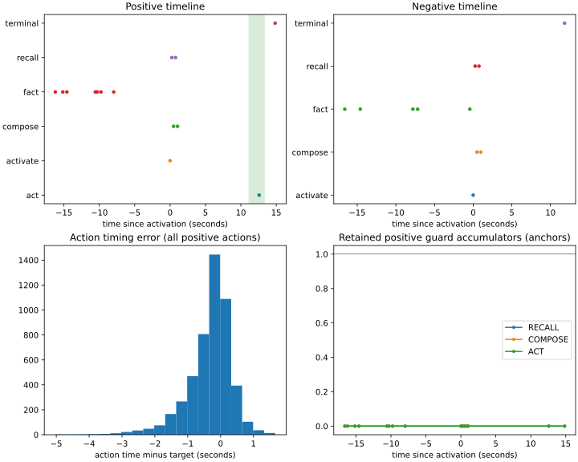

## attempt-ee4586a18d90439590c88bf5c12904ff/validation-8000-one_hop/autonomous

Experiment: phase4-pilot-v1; purpose: pilot_validation; split: validation; stage: one_hop.
Source: `3b132253512f02c0ed9f2d774fefce3036019d91`; config: `62b892f07b07b8b943121a7084d2492e33bb4e295e5dc311f50f9bed23b57729`; manifest: `292a1bf67bbba850db52ff644c6992d520620c08d04191aaa36dcbba8e1e5aa6`; checkpoint: `39f9d1293f7e88e53ec740f43d7ca3bc39bec2eb31cfed8fb0116d0043e3d724`; model seed: 11.

| Outcome | Count / denominator |
| --- | ---: |
| Timed success | 9978 / 10000 |
| Negative false action | 1 / 5000 |
| Errors | 0 / 10000 |

| Variant | Episodes | Timed success |
| --- | ---: | ---: |
| disconnected_negative | 2500 | 2499 |
| positive | 5000 | 4979 |
| safe_negative | 2500 | 2500 |

| Class | Episodes | Timed success |
| --- | ---: | ---: |
| 0 | 1245 | 1241 |
| 1 | 1220 | 1216 |
| 2 | 1284 | 1276 |
| 3 | 1251 | 1246 |
| negative | 5000 | 4999 |

| Event counts | Count |
| --- | ---: |
| act | 4998 |
| activate | 10000 |
| compose | 17498 |
| fact | 59983 |
| recall | 17498 |
| terminal | 10000 |

| Miss categories | Count |
| --- | ---: |
| late | 18 |
| negative_false_action | 1 |
| no_action | 3 |
| success | 9978 |

| Compute | Count |
| --- | ---: |
| backward_macs | 0 |
| flow_evaluations | 119977 |
| forward_macs | 1026850233088 |
| foundation_model_calls | 0 |
| jump_applications | 119977 |
| records_scored | 4319488 |

| Action diagnostics | Count |
| --- | ---: |
| legal_class_0 | 1245 |
| legal_class_1 | 1221 |
| legal_class_2 | 1284 |
| legal_class_3 | 1248 |
| raw_class_0 | 1245 |
| raw_class_1 | 1221 |
| raw_class_2 | 1284 |
| raw_class_3 | 1248 |
| status_disagreements | 0 |

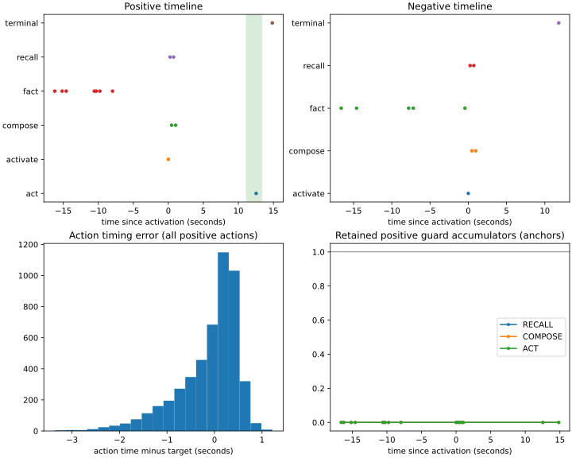

## attempt-ee4586a18d90439590c88bf5c12904ff/validation-9000-one_hop/autonomous

Experiment: phase4-pilot-v1; purpose: pilot_validation; split: validation; stage: one_hop.
Source: `3b132253512f02c0ed9f2d774fefce3036019d91`; config: `62b892f07b07b8b943121a7084d2492e33bb4e295e5dc311f50f9bed23b57729`; manifest: `292a1bf67bbba850db52ff644c6992d520620c08d04191aaa36dcbba8e1e5aa6`; checkpoint: `20f86b09a461b941e9018f298887a6e2275a08614b5a5610efae663ddb078f0a`; model seed: 11.

| Outcome | Count / denominator |
| --- | ---: |
| Timed success | 9993 / 10000 |
| Negative false action | 0 / 5000 |
| Errors | 0 / 10000 |

| Variant | Episodes | Timed success |
| --- | ---: | ---: |
| disconnected_negative | 2500 | 2500 |
| positive | 5000 | 4993 |
| safe_negative | 2500 | 2500 |

| Class | Episodes | Timed success |
| --- | ---: | ---: |
| 0 | 1245 | 1244 |
| 1 | 1220 | 1218 |
| 2 | 1284 | 1282 |
| 3 | 1251 | 1249 |
| negative | 5000 | 5000 |

| Event counts | Count |
| --- | ---: |
| act | 5000 |
| activate | 10000 |
| compose | 17500 |
| fact | 59983 |
| recall | 17500 |
| terminal | 10000 |

| Miss categories | Count |
| --- | ---: |
| late | 7 |
| success | 9993 |

| Compute | Count |
| --- | ---: |
| backward_macs | 0 |
| flow_evaluations | 119983 |
| forward_macs | 1026949658880 |
| foundation_model_calls | 0 |
| jump_applications | 119983 |
| records_scored | 4320000 |

| Action diagnostics | Count |
| --- | ---: |
| legal_class_0 | 1245 |
| legal_class_1 | 1220 |
| legal_class_2 | 1284 |
| legal_class_3 | 1251 |
| raw_class_0 | 1245 |
| raw_class_1 | 1220 |
| raw_class_2 | 1284 |
| raw_class_3 | 1251 |
| status_disagreements | 0 |

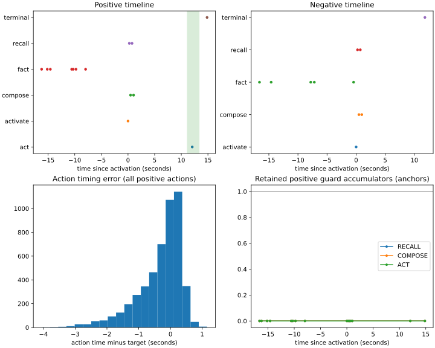

## final/eval/delay_12

Experiment: phase4-pilot-v1; purpose: delay_swap; split: validation; stage: primary.
Source: `3b132253512f02c0ed9f2d774fefce3036019d91`; config: `62b892f07b07b8b943121a7084d2492e33bb4e295e5dc311f50f9bed23b57729`; manifest: `b0e884d4e62acb4e2f9ad39d0b9fa77e9e064264ef1d9b4da0503302a31ce89f`; checkpoint: `bc2850deb2bacb64d336750c5e824390e4a8eb45a3144467e3a61af84c49285b`; model seed: 11.

| Outcome | Count / denominator |
| --- | ---: |
| Timed success | 255 / 256 |
| Negative false action | 0 / 0 |
| Errors | 0 / 256 |

| Variant | Episodes | Timed success |
| --- | ---: | ---: |
| positive | 256 | 255 |

| Class | Episodes | Timed success |
| --- | ---: | ---: |
| 0 | 56 | 56 |
| 1 | 66 | 66 |
| 2 | 76 | 75 |
| 3 | 58 | 58 |

| Event counts | Count |
| --- | ---: |
| act | 256 |
| activate | 256 |
| compose | 996 |
| fact | 3096 |
| recall | 996 |
| terminal | 256 |

| Miss categories | Count |
| --- | ---: |
| late | 1 |
| success | 255 |

| Compute | Count |
| --- | ---: |
| backward_macs | 0 |
| flow_evaluations | 5856 |
| forward_macs | 53375587328 |
| foundation_model_calls | 0 |
| jump_applications | 5856 |
| records_scored | 224000 |

| Action diagnostics | Count |
| --- | ---: |
| legal_class_0 | 56 |
| legal_class_1 | 66 |
| legal_class_2 | 76 |
| legal_class_3 | 58 |
| raw_class_0 | 56 |
| raw_class_1 | 66 |
| raw_class_2 | 76 |
| raw_class_3 | 58 |
| status_disagreements | 0 |

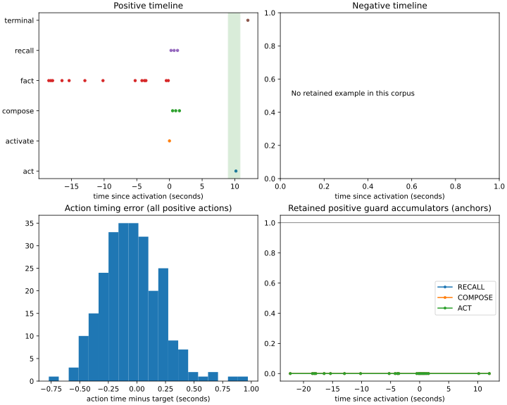

## final/eval/delay_48

Experiment: phase4-pilot-v1; purpose: delay_swap; split: validation; stage: primary.
Source: `3b132253512f02c0ed9f2d774fefce3036019d91`; config: `62b892f07b07b8b943121a7084d2492e33bb4e295e5dc311f50f9bed23b57729`; manifest: `b0e884d4e62acb4e2f9ad39d0b9fa77e9e064264ef1d9b4da0503302a31ce89f`; checkpoint: `bc2850deb2bacb64d336750c5e824390e4a8eb45a3144467e3a61af84c49285b`; model seed: 11.

| Outcome | Count / denominator |
| --- | ---: |
| Timed success | 253 / 256 |
| Negative false action | 0 / 0 |
| Errors | 0 / 256 |

| Variant | Episodes | Timed success |
| --- | ---: | ---: |
| positive | 256 | 253 |

| Class | Episodes | Timed success |
| --- | ---: | ---: |
| 0 | 56 | 55 |
| 1 | 66 | 66 |
| 2 | 76 | 75 |
| 3 | 58 | 57 |

| Event counts | Count |
| --- | ---: |
| act | 256 |
| activate | 256 |
| compose | 996 |
| fact | 3096 |
| recall | 996 |
| terminal | 256 |

| Miss categories | Count |
| --- | ---: |
| premature | 3 |
| success | 253 |

| Compute | Count |
| --- | ---: |
| backward_macs | 0 |
| flow_evaluations | 5856 |
| forward_macs | 53375587328 |
| foundation_model_calls | 0 |
| jump_applications | 5856 |
| records_scored | 224000 |

| Action diagnostics | Count |
| --- | ---: |
| legal_class_0 | 56 |
| legal_class_1 | 66 |
| legal_class_2 | 76 |
| legal_class_3 | 58 |
| raw_class_0 | 56 |
| raw_class_1 | 66 |
| raw_class_2 | 76 |
| raw_class_3 | 58 |
| status_disagreements | 0 |

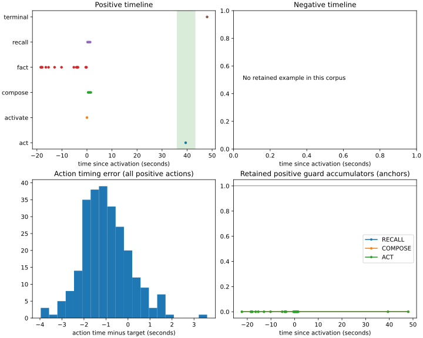

## final/eval/primary

Experiment: phase4-pilot-v1; purpose: pilot_validation; split: validation; stage: primary.
Source: `3b132253512f02c0ed9f2d774fefce3036019d91`; config: `62b892f07b07b8b943121a7084d2492e33bb4e295e5dc311f50f9bed23b57729`; manifest: `b0e884d4e62acb4e2f9ad39d0b9fa77e9e064264ef1d9b4da0503302a31ce89f`; checkpoint: `bc2850deb2bacb64d336750c5e824390e4a8eb45a3144467e3a61af84c49285b`; model seed: 11.

| Outcome | Count / denominator |
| --- | ---: |
| Timed success | 9994 / 10000 |
| Negative false action | 1 / 5000 |
| Errors | 0 / 10000 |

| Variant | Episodes | Timed success |
| --- | ---: | ---: |
| disconnected_negative | 2500 | 2499 |
| positive | 5000 | 4995 |
| safe_negative | 2500 | 2500 |

| Class | Episodes | Timed success |
| --- | ---: | ---: |
| 0 | 1226 | 1226 |
| 1 | 1239 | 1237 |
| 2 | 1266 | 1265 |
| 3 | 1269 | 1267 |
| negative | 5000 | 4999 |

| Event counts | Count |
| --- | ---: |
| act | 5001 |
| activate | 10000 |
| compose | 37461 |
| fact | 120065 |
| recall | 37461 |
| terminal | 10000 |

| Miss categories | Count |
| --- | ---: |
| late | 3 |
| negative_false_action | 1 |
| premature | 2 |
| success | 9994 |

| Compute | Count |
| --- | ---: |
| backward_macs | 0 |
| flow_evaluations | 219988 |
| forward_macs | 1959786497536 |
| foundation_model_calls | 0 |
| jump_applications | 219988 |
| records_scored | 8152576 |

| Action diagnostics | Count |
| --- | ---: |
| legal_class_0 | 1226 |
| legal_class_1 | 1240 |
| legal_class_2 | 1266 |
| legal_class_3 | 1269 |
| raw_class_0 | 1226 |
| raw_class_1 | 1240 |
| raw_class_2 | 1266 |
| raw_class_3 | 1269 |
| status_disagreements | 0 |

## final/eval/primary_repeat

Experiment: phase4-pilot-v1; purpose: pilot_validation; split: validation; stage: primary.
Source: `3b132253512f02c0ed9f2d774fefce3036019d91`; config: `62b892f07b07b8b943121a7084d2492e33bb4e295e5dc311f50f9bed23b57729`; manifest: `b0e884d4e62acb4e2f9ad39d0b9fa77e9e064264ef1d9b4da0503302a31ce89f`; checkpoint: `bc2850deb2bacb64d336750c5e824390e4a8eb45a3144467e3a61af84c49285b`; model seed: 11.

| Outcome | Count / denominator |
| --- | ---: |
| Timed success | 9994 / 10000 |
| Negative false action | 1 / 5000 |
| Errors | 0 / 10000 |

| Variant | Episodes | Timed success |
| --- | ---: | ---: |
| disconnected_negative | 2500 | 2499 |
| positive | 5000 | 4995 |
| safe_negative | 2500 | 2500 |

| Class | Episodes | Timed success |
| --- | ---: | ---: |
| 0 | 1226 | 1226 |
| 1 | 1239 | 1237 |
| 2 | 1266 | 1265 |
| 3 | 1269 | 1267 |
| negative | 5000 | 4999 |

| Event counts | Count |
| --- | ---: |
| act | 5001 |
| activate | 10000 |
| compose | 37461 |
| fact | 120065 |
| recall | 37461 |
| terminal | 10000 |

| Miss categories | Count |
| --- | ---: |
| late | 3 |
| negative_false_action | 1 |
| premature | 2 |
| success | 9994 |

| Compute | Count |
| --- | ---: |
| backward_macs | 0 |
| flow_evaluations | 219988 |
| forward_macs | 1959786497536 |
| foundation_model_calls | 0 |
| jump_applications | 219988 |
| records_scored | 8152576 |

| Action diagnostics | Count |
| --- | ---: |
| legal_class_0 | 1226 |
| legal_class_1 | 1240 |
| legal_class_2 | 1266 |
| legal_class_3 | 1269 |
| raw_class_0 | 1226 |
| raw_class_1 | 1240 |
| raw_class_2 | 1266 |
| raw_class_3 | 1269 |
| status_disagreements | 0 |

## final/eval/robustness

Experiment: phase4-pilot-v1; purpose: pilot_validation; split: validation; stage: robustness.
Source: `3b132253512f02c0ed9f2d774fefce3036019d91`; config: `62b892f07b07b8b943121a7084d2492e33bb4e295e5dc311f50f9bed23b57729`; manifest: `6ca3e94add1e3f193e2a9bc96b477643e222e6569dce86851743f76f7e6b48d3`; checkpoint: `bc2850deb2bacb64d336750c5e824390e4a8eb45a3144467e3a61af84c49285b`; model seed: 11.

| Outcome | Count / denominator |
| --- | ---: |
| Timed success | 9966 / 10000 |
| Negative false action | 1 / 5000 |
| Errors | 0 / 10000 |

| Variant | Episodes | Timed success |
| --- | ---: | ---: |
| disconnected_negative | 2500 | 2499 |
| positive | 5000 | 4967 |
| safe_negative | 2500 | 2500 |

| Class | Episodes | Timed success |
| --- | ---: | ---: |
| 0 | 1246 | 1236 |
| 1 | 1219 | 1214 |
| 2 | 1223 | 1215 |
| 3 | 1312 | 1302 |
| negative | 5000 | 4999 |

| Event counts | Count |
| --- | ---: |
| act | 5001 |
| activate | 10000 |
| compose | 37546 |
| fact | 119778 |
| recall | 37546 |
| terminal | 10000 |

| Miss categories | Count |
| --- | ---: |
| late | 21 |
| negative_false_action | 1 |
| premature | 12 |
| success | 9966 |

| Compute | Count |
| --- | ---: |
| backward_macs | 0 |
| flow_evaluations | 219871 |
| forward_macs | 1961752723456 |
| foundation_model_calls | 0 |
| jump_applications | 219871 |
| records_scored | 8168896 |

| Action diagnostics | Count |
| --- | ---: |
| legal_class_0 | 1246 |
| legal_class_1 | 1219 |
| legal_class_2 | 1223 |
| legal_class_3 | 1313 |
| raw_class_0 | 1246 |
| raw_class_1 | 1219 |
| raw_class_2 | 1223 |
| raw_class_3 | 1313 |
| status_disagreements | 0 |

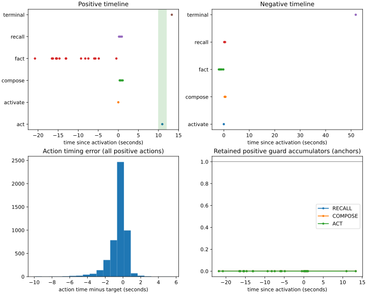

## final/eval/two_hop

Experiment: phase4-pilot-v1; purpose: pilot_validation; split: validation; stage: two_hop.
Source: `3b132253512f02c0ed9f2d774fefce3036019d91`; config: `62b892f07b07b8b943121a7084d2492e33bb4e295e5dc311f50f9bed23b57729`; manifest: `1cfb1f613578eafc0e6ef7c2c664006e4ee7331e9ae324ba65f3376783a50c45`; checkpoint: `bc2850deb2bacb64d336750c5e824390e4a8eb45a3144467e3a61af84c49285b`; model seed: 11.

| Outcome | Count / denominator |
| --- | ---: |
| Timed success | 9991 / 10000 |
| Negative false action | 3 / 5000 |
| Errors | 0 / 10000 |

| Variant | Episodes | Timed success |
| --- | ---: | ---: |
| disconnected_negative | 2500 | 2497 |
| positive | 5000 | 4994 |
| safe_negative | 2500 | 2500 |

| Class | Episodes | Timed success |
| --- | ---: | ---: |
| 0 | 1211 | 1211 |
| 1 | 1239 | 1238 |
| 2 | 1221 | 1219 |
| 3 | 1329 | 1326 |
| negative | 5000 | 4997 |

| Event counts | Count |
| --- | ---: |
| act | 5003 |
| activate | 10000 |
| compose | 27508 |
| fact | 110683 |
| recall | 27508 |
| terminal | 10000 |

| Miss categories | Count |
| --- | ---: |
| late | 3 |
| negative_false_action | 3 |
| premature | 3 |
| success | 9991 |

| Compute | Count |
| --- | ---: |
| backward_macs | 0 |
| flow_evaluations | 190702 |
| forward_macs | 1570725036288 |
| foundation_model_calls | 0 |
| jump_applications | 190702 |
| records_scored | 6241728 |

| Action diagnostics | Count |
| --- | ---: |
| legal_class_0 | 1213 |
| legal_class_1 | 1239 |
| legal_class_2 | 1222 |
| legal_class_3 | 1329 |
| raw_class_0 | 1213 |
| raw_class_1 | 1239 |
| raw_class_2 | 1222 |
| raw_class_3 | 1329 |
| status_disagreements | 0 |

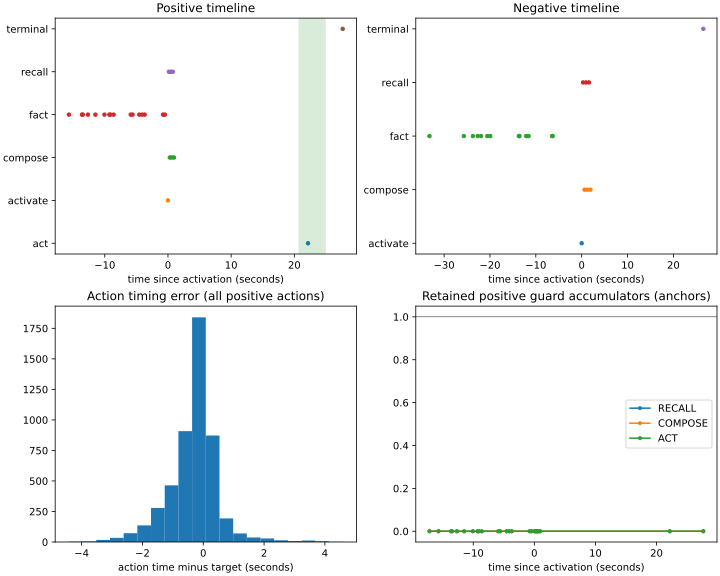

## final/offline/run/eval/primary

Experiment: phase4-offline-diagnostic; purpose: debug; split: debug; stage: primary.
Source: `3b132253512f02c0ed9f2d774fefce3036019d91`; config: `f9b1fa70f4bbb075fef516b491125ff975cdb36301639741a44ad1f92956069b`; manifest: `fbd0f7bd64cf8cf7828054e6a8a5d53121ef57dc5a2c1641f7006ed3f368f9f7`; checkpoint: `90949d5d03c4ade27444542b9edab8b14f6e3da32794d86d8643ba73e59e6478`; model seed: 11.

| Outcome | Count / denominator |
| --- | ---: |
| Timed success | 7 / 16 |
| Negative false action | 1 / 8 |
| Errors | 0 / 16 |

| Variant | Episodes | Timed success |
| --- | ---: | ---: |
| disconnected_negative | 4 | 4 |
| positive | 8 | 0 |
| safe_negative | 4 | 3 |

| Class | Episodes | Timed success |
| --- | ---: | ---: |
| 0 | 2 | 0 |
| 1 | 2 | 0 |
| 2 | 2 | 0 |
| 3 | 2 | 0 |
| negative | 8 | 7 |

| Event counts | Count |
| --- | ---: |
| act | 1 |
| activate | 16 |
| compose | 19 |
| fact | 222 |
| recall | 20 |
| terminal | 16 |

| Miss categories | Count |
| --- | ---: |
| negative_false_action | 1 |
| no_action | 8 |
| success | 7 |

| Compute | Count |
| --- | ---: |
| backward_macs | 0 |
| flow_evaluations | 294 |
| forward_macs | 569410368 |
| foundation_model_calls | 0 |
| jump_applications | 294 |
| records_scored | 4864 |

| Action diagnostics | Count |
| --- | ---: |
| legal_class_2 | 1 |
| raw_class_2 | 1 |
| status_disagreements | 0 |

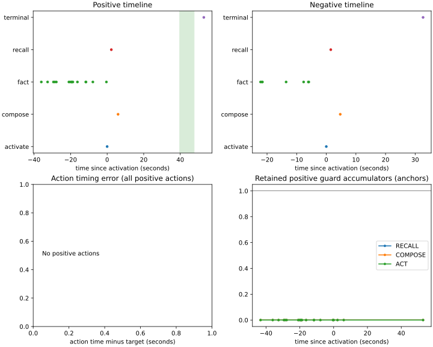

